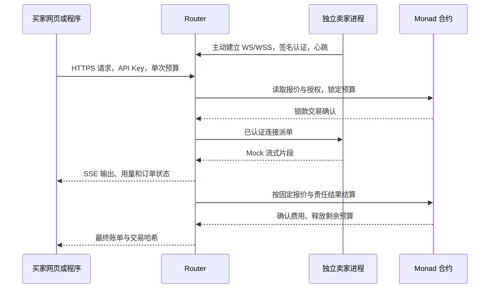

# 架构、计费与协议

本文件描述当前**原生 MON 源码**的约定；新市场已部署，公网 23cc7f8 运行 MON/18，D17 要求旧 dUSD 只留私有整账本备份和公开回执存档，退出活跃产品。完成度见 [进度](progress.md)。底层接口细节同时见 [Router README](../server/README.md) 与 [卖家 README](../provider/README.md)。

## 请求如何连接



买家只知道 Router 的地址。卖家钱包是身份和收款地址，`provider_id` 是平台选商标识，`model` 是模型标识；这三者都不是卖家的公网 URL。远程使用 HTTPS/WSS，本机允许 HTTP/WS。卖家控制台只监听回环地址，不需要暴露到公网。

| 组件 | 职责 | 源码 |
| --- | --- | --- |
| Web | 模型选择、流式体验、账单、钱包资金操作、卖家报价和 API 管理界面 | [web/components](../web/components/) |
| Router | 买家和卖家认证、报价读取、匹配、计量、预算、责任、持久化与重试 | [server/src](../server/src/) |
| Provider | 独立身份、主动长连接、Mock 响应、故障模式、本地控制台 | [provider/src](../provider/src/) |
| InferenceMarket（原生 MON） | 18 位 wei，payable 存款、报价、授权、锁款、结算、回收及原生提款 | [InferenceMarket.sol](../contracts/src/InferenceMarket.sol) |

### 流式消息与界面状态

修复已随 fc646d8 部署，公开接口回读通过，网页单笔完成及链上结算已验，但公网逐帧展示未采证：Provider Hub 串行完成认证及消息准入，已认证业务事件分发不等待链上结算。Engine 继续按 `requestId` 串行处理片段和终态，保证同一订单顺序；另一订单等待结算时，不阻塞该连接的心跳与其他订单输出。认证期间断线会终止接入，异步业务错误仍有明确处理。依据为 [Hub](../server/src/provider-hub.ts) 和 [6 项回归](../server/test/provider-hub.test.ts)，其中真实本地 WS → HTTP/SSE 覆盖两单并发。

Web 同时接收 SSE 和轮询快照，[合并规则](../web/lib/order-snapshot.ts) 保留已确认账单及终态，拒绝输出长度/计量减少、running 回退 locking 和明确更旧的快照；即使时间戳相同或缺失，也不允许旧轮询撤回已展示输出。链上预算提交与确认阶段单独提示，首个 SSE 事件仍需等待锁款；本轮未改 SSE 协议或代理设置。测试与线上状态分开记录在[进度](progress.md)。

## 资金与权限

买家调用 payable `deposit()`，通过 `msg.value` 存入原生 MON，再调用 `authorizeRouter(totalLimit, expiresAt)` 设置独立消费授权；不再需要 ERC-20 approve。Router 只能使用合约内获授权的托管余额，不能直接从钱包任意扣 MON。买家存款/授权/提款仍需预留链上 Gas。API Key 只代表调用身份，不会增加授权、签交易或获得提款权。

锁款占用买家的可用余额和对应授权额度。结算把实际费用记入卖家合约余额，剩余金额还给买家的可用余额；卖家自行提款。结算不调用卖家收款回退函数，避免拒收阻断结算；原生提款先减内部余额、采用防重入，转账失败完整回滚。`revokeRouter` 或授权过期阻止新锁款，已锁订单仍使用原授权和原预算结算。更换授权后，旧在途订单只影响旧授权记录。

只有固定 Router 地址能 `reserve` 和 `settle`；只有余额所有者能 `withdraw`。每单截止时间到达后，只有该买家能 `reclaimExpired`。合约要求期限前结算、期限到达后回收，二者互斥；已结算或回收的 ID 不能再次扣费。

合约验证权限、报价版本、金额计算、预算和终态，**不能证明模型真实、输出质量或链外用量真实**。Router 仍是受信的计量和判责方。Prompt、Response 和凭证不上链；平台和接单卖家都可见内容，WSS 不代表端到端保密。钱包、金额、用量和交易时间等元数据仍公开。

## 计价口径

`input`、`cacheRead`、`cacheWrite`、`output` 四项报价均为 **MON / 百万模拟 Token**。金额字符串最多 18 位小数；内部使用整数 wei，`1 MON = 10^18 wei`。`ASSET_SCALE` 与计费分母 `TOKENS_PER_MILLION = 10^6` 分开，不能随资产精度一起改分母。一个 Unicode 码点等于一个模拟 Token，不是任何真实模型的 tokenizer。

输入数是 `JSON.stringify(messages)` 的 Unicode 码点数，包含角色字段和序列化结构。输出只计算 Router 按序接受的片段字符，不采信卖家自报数量。

```text
费用最小单位 = ceil(Σ(各类单价最小单位 × 各类用量) / 1,000,000)
释放金额 = 锁定预算 − 最终费用
```

四类乘积相加后统一向上舍入一次。报价 0.3 / 0.03 / 0.375 / 0.8，普通输入 100、输出 100 时，费用为 `0.000110 MON`（110000000000000 wei）。最低预留只决定能否接单，不抬高实际收费。

缓存按买家钱包、卖家钱包与 ID、模型、完整 messages 分隔。成功的缓存写入保留一小时；相同边界内再次请求可读缓存。普通输入、缓存读取、缓存写入互斥。派单前按可能的最高输入单价检查预算，不把预计命中当成预算保证。

Router 按实际缓存分类与 `max_tokens` 估算总成本，选择有容量且满足输入预算、最低预留的卖家。派单前重新读报价；合约检查版本并保存快照。请求开始后不自动切换卖家，不自动重放推理。每次接受输出前检查预算及输出上限，必要时在码点边界截断。

| 结果 | `outcome` | 推理费 |
| --- | --- | --- |
| 正常完成 | `0` | 实际用量 |
| 买家显式取消 | `1` | 取消生效前已计量用量 |
| 预算或输出上限触顶 | `2` | 实际用量，始终不超过预算 |
| 卖家失败、超时、断连或无效片段 | `3` | 整单为零，包含已输出部分 |
| 平台故障或无法确认派单 | `4` | 整单为零 |

关闭网页或 SSE 不等于取消。终态事件逐单串行：卖家失败先成立则全免；取消先成立则按当时用量计费，后续断连不改判。推理费减免不退还已经消耗的链上 Gas。

## MON 单资产与历史归档

当前唯一市场为 `0x142a4904307244Bed0cECD72dE8329A253333182`、MON/18。D17 删除旧 dUSD UI、ABI、代码与兼容读取；旧公开回执是历史证据，旧订单/凭证整账本保留服务器私有备份，不在新产品中展示或恢复。

新活跃账本只接受当前原生 MON 市场身份，旧订单、API Key、平台 session、缓存和幂等映射不迁入。钱包身份不变，但需重新取得平台 session，并在有效 MON grant 下创建新 Key。D17 迁移时保留了旧 buyer + createdAt 最小配额历史；D19 已要求其只作历史，不再参与请求次数计算。取消限制已在 0a82030 生效，不能靠清空账本、凭证或订单实现。原链上资产/历史不可删除，本轮不兑换、销毁或代提款。

## 状态和恢复

链上订单只有 `None → Reserved → Settled / Reclaimed`。Router 另存业务状态：`locking`、`running`、`completed`、`buyer_cancelled`、`budget_capped`、`seller_failed`、`platform_failed`、`reservation_unknown`、`lock_failed`。

业务结束与结算确认是两条状态：`settlement` 为 `unsubmitted / pending / confirmed / failed`。只有 `billConfirmed: true` 才是已确认账单；之前的 `charge`、`released` 是预计值。推理失败与结算交易失败不能混为一谈。

锁款结果不明时进入 `reservation_unknown`，不派单，继续查询同一订单；若晚到的锁款确认出现，按平台故障零费用释放。重启不重放在途推理。结算失败定期幂等重试；超过链上截止时间后由买家直接回收。

当前 Router 默认推理超时 30 秒，订单锁款截止时间为创建后约 300 秒；合约允许的最大期限为一小时。消息开始计时和链上截止时间用途不同。状态文件由单个 Router 进程独占，原子替换并限制为所有者读写；要运行多实例，必须先改用具备事务能力的共享存储。

### 演示限制取消与保留边界

[D19](requirements-and-decisions.md#d19--取消演示次数与额外并发限制) 已授权移除 D14 的每日/累计次数与每钱包/全局额外并发门槛。当前代码已删除 DemoAdmission、DEMO_LIMITS、Engine 第四构造参数及三项 DEMO_* 解析，不加入新的暂停开关；本地根 97/97 和类型检查、服务器专项 18/18 已通过，0a82030 运行源码及三项旧配置移除均已确认；本轮没有真实超阈值订单测试。

单笔预算、链上可用余额和未过期消费授权、卖家真实 capacity、身份验证、幂等防重复与逐订单事件保序继续生效。原订单、凭证及 admissionHistory 保留；history 只作历史，不再计次。认证频率与 none/loopback 代理信任不是本次取消的 Demo 门槛。旧策略来源见 [D14](requirements-and-decisions.md#d14--公网演示使用持久新单限额与明确代理信任)，当前执行状态见[运行手册](runbook.md#可选公网请求限额)。

## 买家 HTTP API

| 接口 | 权限 | 用途 |
| --- | --- | --- |
| `GET /health`、`GET /config` | 公开 | 链模式、当前 MON 市场/资产身份、Mock 标记与在线节点数 |
| `GET /v1/models` | 公开 | 在线卖家、容量与报价 |
| `POST /auth/challenge` | 公开 | 获取五分钟、单次钱包签名挑战 |
| `POST /auth/verify` | 有效签名 | 换取一天的 bearer 钱包会话 |
| `GET /account` | 会话或 Key | 当前可用余额和剩余授权 |
| `POST /api-keys` | 仅会话 | 有有效链上授权时生成 Key，明文只返回一次 |
| `GET /api-keys`、`DELETE /api-keys/{id}` | 仅会话 | 列举或撤销当前钱包的 Key |
| `POST /v1/chat/completions` | 会话或 Key | 创建文本聊天订单 |
| `GET /v1/requests`、`GET /v1/requests/{id}` | 会话或 Key | 自己的最近订单及账单 |
| `POST /v1/requests/{id}/cancel` | 会话或 Key | 显式取消自己的请求 |

认证使用 `Authorization: Bearer ...`。挑战绑定 Router host、钱包、随机 nonce 和有效期。服务端保存会话和 API Key 哈希。API Key 默认七天，可设置一至三十天，但不超过当前链上授权到期时间。多个 Key 共用钱包的链上消费限额。 新 MON API Key 由钱包 session 与有效 MON grant 创建，并绑定当前 market_address。D17 不迁移旧平台凭证，因此旧 API Key/session 不能访问新服务；此凭证限制与下文 Idempotency-Key 的防重复规则独立。钱包 session 发起下单/取消时还需 `X-InferPool-Market` 精确匹配当前市场地址；缺失或不匹配返回 409，要求刷新确认，避免旧网页误向新市场消费。

请求主体示例：

```json
{
  "model": "mock-reasoner",
  "messages": [{ "role": "user", "content": "演示预算与链上结算" }],
  "max_tokens": 256,
  "max_spend": "0.001",
  "provider_id": "seller-1",
  "stream": true,
  "cache": false
}
```

`messages` 支持 `system/user/assistant` 的文本消息，一至六十四条；每条最多 32,000 字符。`max_tokens` 一至 8,192，默认 256。`max_spend` 必须是正十进制字符串。`provider_id` 可省略自动匹配。顶层未知字段被拒绝，不承诺完整 OpenAI API 兼容。

使用 `Idempotency-Key`（一至 128 字符）避免重复创建。同钱包、同市场、同 Key、同参数返回原订单，换参数返回 `409`；D17 不迁移旧凭证和旧幂等映射，旧客户端不能用旧认证自动向新市场扣费。`stream` 不改变订单指纹。新的独立请求要用新 Key。

SSE 有标准形状的文本 `data` 增量和 `event: request` 订单快照，末尾 `[DONE]`。快照的 `output` 已是完整文本；消费者选择替换快照或追加增量，不能两者同时叠加。响应头 `X-Request-Id` 和快照中的 ID 可供断线后查询。最终快照可能仍是待重试的结算失败，不能只凭 `[DONE]` 宣称链上结算完成。

常见拒绝：`400` 参数错误；`401` 无效凭证；`402` 余额/授权不足；`403` 会话权限或 Origin 不符；`404` 无权查看的订单；`409` 幂等冲突、无可用报价或锁款期间暂不能取消。具体错误以响应和 [app.ts](../server/src/app.ts) 为准。

## 卖家 WebSocket 协议

1. `/provider` 发出 `challenge {nonce,message,expiresAt}`，节点核对域名与时效后签名。
2. 节点发 `auth {address,signature,mock:true,provider:{id,name,modelId,capacity,pricing,mode}}`；链上报价必须有效。
3. `authenticated {providerId,quote,mock}` 返回确认报价；失败返回 `rejected {message}`。本地配置报价不能覆盖链价。
4. 节点每五秒发送 `heartbeat {availableSlots,mode}`；三十秒无心跳会断开。Router 确认锁款后发送 `request {requestId,buyer,model,messages,maxTokens,cache,usage}`。
5. 节点回复 `started`、`chunk {requestId,seq,text,outputTokens}`、`completed` 或 `failed`。片段序号从零连续递增，重复片段忽略，缺号导致卖家失败全免。
6. Router 发 `cancel {requestId,reason}` 后节点停止，并回复 `cancelled`；重新连接要重新认证，不重放旧请求。

本地控制台可改正常/超时/首输出前失败/中途失败/缓存模式。保存本地报价仅修改节点配置并重新读取链价；发布价格必须由卖家钱包调用合约。链上有效报价与最近一次连接确认的报价可能不同，每单仍重新读取。

### 浏览器钱包 Provider 认证扩展

[D13](requirements-and-decisions.md#d13--浏览器钱包为独立-provider-签署认证挑战) 新增与现有三种身份互斥的浏览器钱包模式：Provider 绑定 `--browser-wallet <address>` 和 `--wallet-ui <origin>`，本地控制台向 [Web 接入页](../web/app/provider-connect/page.tsx) 请求 Para 签署受限的 Provider 认证挑战，再交给节点完成 Router WebSocket 身份认证。源码与自动检查、真实 Para 首次签名、双节点同时在线和主动下线已验证，完整成交范围见进度。

双向核对 `postMessage` 的 origin/source，保留本地 HTTP 的 CSRF 与同源要求，不为浏览器跨站请求增加 CORS。节点在网页主动准备后才连接，一次准备只接受一次精确的 Provider 认证挑战，最长 12 秒，核对用途、域名、nonce、有效期、请求 ID 和钱包并验证签名；断线后重新准备，不自动重连。签名不导出私钥、不新增 Alchemy 会话，也不授予代币转账、报价或消费权限；B 报价已由独立交易发布，不能把它当作节点认证或成交通过。使用步骤见 [Provider README](../provider/README.md#使用-para-网页钱包)。

## 买家钱包实现边界

当前采用 Para 邮箱内嵌 EVM 钱包与 viem，暂不接外部钱包或 WalletConnect。`NEXT_PUBLIC_PARA_API_KEY` 是前端公开配置；私密 Key 不需要出现在 Web 项目中。Para 登录、钱包就绪、Router 签名登录和链上消费授权各自有状态，不能把其中一步当作全部完成。

交易必须保留 Para 提供的真实 `LocalAccount` 签名器；只传地址字符串会转成 JSON-RPC 账户语义。交易前核对链 ID、估算 Gas、等待成功回执。资金面板通过直接 RPC 读取合约，可输入请求 UUID 或 bytes32 ID，在 Router 不可用时查询并回收已过期订单。此部分源码已经写入，最终交互验证状态见 [进度](progress.md)。
